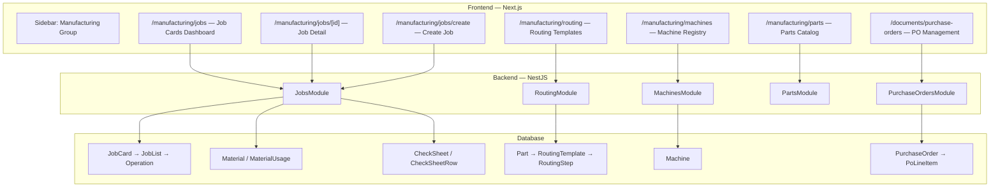

# Jobs Dashboard — Implementation Plan

Manufacturing module for eBST covering job card lifecycle, routing templates, check sheets, and inventory/machine integration, along with Purchase Order handling.

---

## Architecture Overview



---

## 🔧 Pre-Requisite Schema Migration

Update the Prisma schema to support "Job to Stock" workflows (jobs without POs):

1. **Modify `JobCard`**:
```prisma
model JobCard {
  // ...
  purchaseOrderId String? @unique // Made optional
  purchaseOrder PurchaseOrder? @relation(fields: [purchaseOrderId], references: [id])
  // ...
}
```
2. **Run migration**: `npx prisma migrate dev --name make_jobcard_po_optional`

---

## Proposed Changes

### Component 1: Purchase Order Management

Since POs are documents provided by customers, we will implement a hybrid approach:

#### Backend: `PurchaseOrdersModule`
- **Endpoints**: `GET /purchase-orders`, `POST /purchase-orders`
- **Logic**: Store PO details and `PoLineItem`s. Additionally, link the uploaded original document to a `BusinessDocument` record.

#### Frontend: `/documents/purchase-orders`
- **List Page**: View all POs.
- **Create PO Flow**: 
  1. Upload PO document (PDF via `FilesService`).
  2. Manual entry form: Fill in PO number, customer, due date, and line items (part, qty, price).
  3. *(Stretch Goal)*: Integrate an OCR service to auto-extract line items from the PDF into the form for executive review.

---

### Component 2: Backend — Manufacturing Modules

New backend modules following the existing pattern (`Controller` + `Service` + `Module` + `DTOs`).

#### [NEW] `JobsModule` (`/jobs`)
| Method | Route | Role | Description |
|--------|-------|------|-------------|
| `GET` | `/jobs` | EXECUTIVE, ADMIN | List all job cards with nested jobLists & summary |
| `GET` | `/jobs/:id` | EXECUTIVE, ADMIN, OPERATOR | Full job card detail |
| `POST` | `/jobs` | EXECUTIVE | **Create Job Card**: Accepts optional PO ID, parts & quantities, and explicitly specified **materials to deduct**. Auto-generates nested job lists and operations based on routing templates. Creates `MaterialUsage` records to deduct stock. |
| `PATCH` | `/jobs/:id/status` | EXECUTIVE | Update job card status (ON_HOLD / CANCELLED) |
| `PATCH` | `/jobs/operations/:id/start` | OPERATOR, EXECUTIVE | Start an operation (locks machine) |
| `PATCH` | `/jobs/operations/:id/complete` | OPERATOR, EXECUTIVE | Complete an operation |
| `POST` | `/jobs/operations/:id/qc` | EXECUTIVE | Log QC result (PASS/REPAIR/REJECT) |
| `POST` | `/jobs/operations/:id/checksheet` | EXECUTIVE, OPERATOR | Create check sheet (melting or finishing) |

#### [NEW] `PartsModule` (`/parts`)
CRUD for Parts catalog, filtered by Cast Type.

#### [NEW] `RoutingModule` (`/routing`)
| Method | Route | Role | Description |
|--------|-------|------|-------------|
| `GET` | `/routing/:partId` | EXECUTIVE | Get routing template for a specific part |
| `PUT` | `/routing/:partId` | EXECUTIVE | Upsert routing template (create or replace steps) |

#### [NEW] `MachinesModule` (`/machines`)
List/create machines. Service tracks "busy/idle" state derived from in-progress operations.

#### [MODIFY] `app.module.ts`
Register the new modules.

---

### Component 3: Frontend — React Query Hooks

Create cohesive custom hooks for API integration:
- **`usePurchaseOrders.ts`**: `usePurchaseOrders()`, `useCreatePurchaseOrder()`
- **`useJobs.ts`**: `useJobCards()`, `useJobCardDetail()`, `useCreateJobCard()`, `useStartOperation()`, `useCompleteOperation()`, `useSubmitQc()`, `useCreateCheckSheet()`
- **`useParts.ts`**: `useParts()`, `useCreatePart()`
- **`useRouting.ts`**: `useRoutingForPart()`, `useUpsertRouting()`
- **`useMachines.ts`**: `useMachines()`, `useCreateMachine()`

---

### Component 4: Frontend — Pages & Layout

Creates a new authenticated route section: `app/(authenticated)/manufacturing/` with a sub-navigation header layout.

#### Jobs Dashboard (`/manufacturing/jobs`)
**Tab 1: All Jobs**
- Search/filter job cards. Click to view details. Derived status badges (PENDING, IN_PROGRESS, COMPLETED, etc.).

**Tab 2: Create Job**
- **Step 1: Link or Create**: Select an existing Purchase Order, OR toggle "Job to Stock" mode to manually specify parts and quantities.
- **Step 2: Operations Preview**: System previews auto-generated job lists based on parts' routing templates.
- **Step 3: Material Deduction (Option B)**: Executive explicitly specifies the materials and quantities needed for this job from inventory. Form shows current inventory stock and warns if dipping below thresholds.
- **Step 4: Confirm**: Create JobCard, deduct inventory.

#### Job Detail (`/manufacturing/jobs/[id]`)
- Renders the full Job hierarchy (`JobList`s -> `Operation`s).
- **Operation Actions**: Start (assign machine), Complete, QC. 
- **Check Sheet Actions**: 
  - *Melting*: Upload file to `FilesService` -> creates `BusinessDocument` linked via `CheckSheet`.
  - *Finishing*: Open dimensional measurement dialog -> dynamic grid (target, measured, tolerance). Calculates pass/fail.

#### Routing Templates (`/manufacturing/routing`)
- Select a Part -> edit its ordered routing steps (Moulding, Pouring, etc). Drag-and-drop ordering. Include buttons to load default Sand/Investment templates.

#### Parts & Machines (`/manufacturing/parts`, `/manufacturing/machines`)
- Standard CRUD datatables for maintaining master data.

---

### Component 5: Navigation & Auth
- **Sidebar**: Update `app-sidebar.tsx` -> add "Manufacturing" collapsible menu. (Jobs, Routing, Parts, Machines). Add "Purchase Orders" under the "Documents" or "Accounting" group.
- **Guards**: Apply NestJS `RolesGuard` so only `EXECUTIVE`/`ADMIN` can plan jobs/routings, while `OPERATOR` can view jobs and log checklist/completion.
